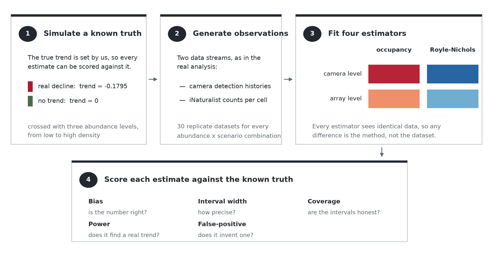
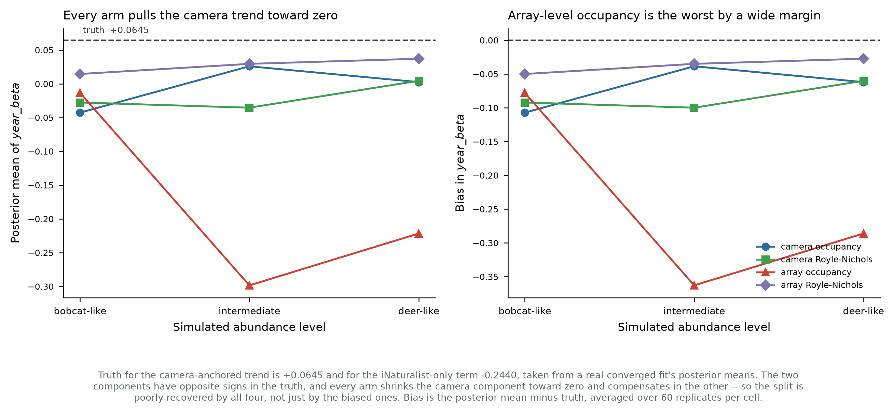
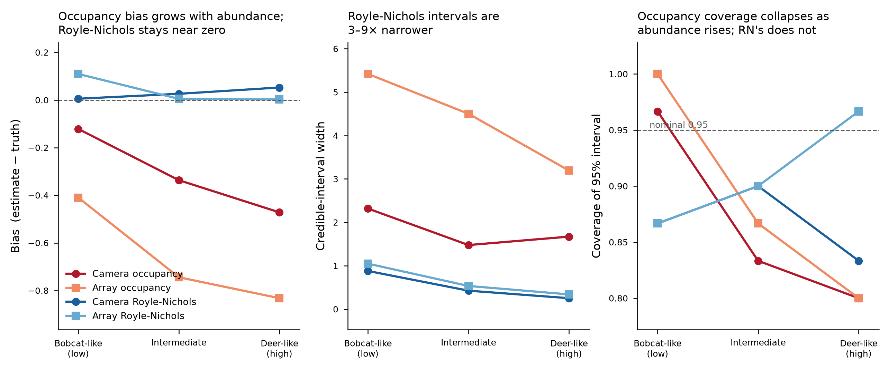
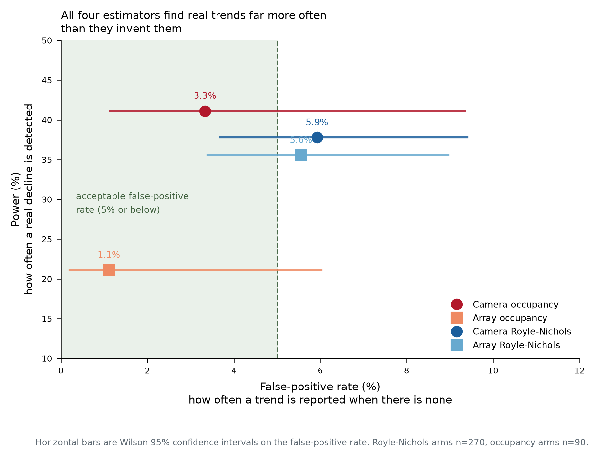

# Estimator choice for camera-trap trend models: a simulation study

**Question.** When camera-trap data are integrated with opportunistic
iNaturalist records to estimate a population trend, does it matter whether the
camera side is modelled at the level of the individual camera or the level of
the camera array, and whether occupancy or Royle-Nichols is used? The array-level
question matters practically because array-level data are far cheaper to
assemble across projects.

## 1. Design

Four estimator arms — camera-level occupancy, camera-level Royle-Nichols,
array-level occupancy, array-level Royle-Nichols — were each fitted to the same
simulated datasets, at three abundance levels, under two spatial scenarios, with
60 replicates per cell.

**The arms differ only in the camera-side observation model.** The iNaturalist
likelihood is identical in all four: a negative-binomial count model with the
effort offset, `y_inat ~ dnbinom(size = 1/overdisp_inat, prob = f(effort, mu))`.
Royle-Nichols is never applied to the iNaturalist records; they are a count per
unit effort throughout, which is the only sensible treatment of them. What
changes across arms is whether the camera stream enters as detection/non-
detection (`dOcc_v`) or as a latent-abundance count (`N ~ dpois`), and whether
the unit is the individual camera or the array.

Replicates are generated from `model_code_national_scalar` with parameters taken
from a real converged bobcat fit, so the truth is known exactly. The trend enters
as two components: a camera-anchored slope (`year_beta`, truth **+0.0645**) that
the camera occupancy submodel contains, and an iNaturalist-only increment
(`year_var`, truth **−0.2440**) that appears in no camera likelihood term. Their
sum, **−0.1795**, is the slope the iNaturalist count stream observes. The two
components have opposite signs in the truth.

## 2. Recovery of the camera-anchored trend

**Every arm shrinks the camera-anchored trend toward zero.** Truth is +0.0645;
posterior means range from −0.30 to +0.04 and the bias is negative in all twelve
arm-by-abundance cells. The split between the two components is therefore poorly
identified even in a correctly-specified simulation, with each arm compensating
in the iNaturalist term.

**Array-level occupancy is much worse than the other three.** Its bias reaches
−0.363 at intermediate and −0.286 at deer-like abundance, against −0.027 to
−0.107 for every other arm. Array-level Royle-Nichols is the most accurate at
every abundance level (−0.050, −0.035, −0.027) and improves as abundance rises.
The two camera-level arms are close to each other throughout and show no clear
abundance trend.

The practical reading: **aggregating cameras to the array is what damages the
camera-anchored trend, and only when combined with occupancy.** Array-level
Royle-Nichols recovers the trend as well as camera-level modelling does, which is
the result that matters for reusing array-level data.

## 3. How the camera-side specification propagates into the summed slope

The summed slope `total_var_beta` is the coefficient the iNaturalist count model
carries, and the iNaturalist likelihood is the same in every arm — so any
difference between arms here is not a difference in how the iNaturalist records
were analysed. It arises because the model is fitted jointly: the summed slope is
tied to the camera-anchored slope by construction over a shared latent abundance
surface, so a camera-side specification that estimates its own slope poorly
displaces the sum as well.

That displacement is large. Both arms using a latent-abundance camera model
recover the summed slope close to its true value at every abundance level, while
both occupancy-based arms overstate the decline and do so increasingly with
abundance — camera-level occupancy reaching roughly three times the true slope
at deer-like abundance, array-level occupancy up to six times. Interval widths
follow the same pattern.

Occupancy saturation is the plausible mechanism on the camera side: occupancy
reads presence and absence, so once most sites are near-certain detections its
information about log abundance collapses, whereas detection frequency across
replicate windows keeps discriminating past that point. This section should be
read as a diagnostic that a saturating camera model distorts the joint fit, not
as a recommendation about how to model opportunistic records.

## 4. Error rates

All four arms detect real trends far more often than they report absent ones.
Note that detection rate alone is a misleading criterion here: at deer-like
abundance camera-level occupancy's detection rate matches or exceeds
Royle-Nichols' while its point estimate is roughly three times too negative.
Detection rate conflates bias with precision and should not be used to rank
these estimators.

One column in the collected output requires care. A camera-corroboration
indicator was computed as a threshold on the ratio of the two trend components.
Because the generating truth has those components in opposite signs, that ratio
is negative by construction and the indicator cannot fire in any arm. It
therefore measures a property of the simulated truth, not of any estimator.

## 5. Applicability to real camera data

The simulation generates data from the occupancy model, so its heterogeneity is
Poisson-consistent by construction. Real camera detection histories are not.

Comparing two statistics among detecting deployments — the mean fraction of
10-day windows with a detection, and the fraction of deployments detecting in
every window — against the region reachable by Royle-Nichols across all
combinations of abundance and per-individual detectability: **69 of 78
species-by-window-count cases fall above the reachable band**, two inside, and
seven below, of which six are sampling zeros against a ceiling of 0.003 or less.
Real detections are more polarised than Poisson abundance with a constant
per-individual detection probability can generate: given how often a species is
detected on average, far more deployments detect in every single window than the
model permits.

Two limits on that diagnostic. Abundance and per-individual detectability are not
separately identified at our window counts — at four windows, (25, 0.03) and
(0.11, 0.52) reproduce the same two statistics to machine precision — so no
per-species abundance cutoff follows from it. And the band is built from two
summary statistics rather than the full detection-history likelihood; a formal
goodness-of-fit test would likely reject more strongly, not less.

Occupancy's saturation limit is real but reached by only one species in the
fleet. From fitted per-site occupancy, white-tailed deer sits at a median of
0.952 with 68% of sites above 0.9; bobcat (0.156) and moose (0.033) are far
below. Across all 34 fleet species, range-restricted naive occupancy puts deer
at 0.794 and the next species, eastern gray squirrel, at 0.478. Commonly
detected species such as gray squirrel and raccoon sit near occupancy's most
informative point rather than past it.

## 6. Conclusions

1. **Array-level Royle-Nichols is a viable substitute for camera-level
   modelling** of the camera-anchored trend, and array-level occupancy is not.
2. **A saturating camera model distorts the jointly-fitted iNaturalist slope**,
   increasingly so at higher abundance, even though the iNaturalist likelihood
   is identical across arms. This is a reason to avoid an occupancy camera
   submodel for abundant species, not a statement about modelling opportunistic
   records — those are a count per unit effort in every arm.
3. **Neither result licenses Royle-Nichols on our real data as specified.** Its
   observation model is rejected for essentially every fleet species, in the
   direction of unmodelled overdispersion.
4. **The trend split is poorly identified in simulation** by all four arms, which
   bounds how much confidence any of them supports in separating a
   camera-anchored trend from an opportunistic-only one at this replicate count.
5. **Occupancy saturation is a single-species concern** in this fleet, not a
   general one.

Candidate next steps, in order of cost: a detection-rate count model (negative
binomial on events per camera-night, giving both streams the same functional form
and no saturation, at the cost of conflating abundance with activity);
Royle-Nichols with negative-binomial abundance; or Royle-Nichols with a
site-level random effect on detectability, which is testable rather than assumed
since deployment records include whether a camera was placed on a trail.

## 7. Limitations

- Coverage, interval width, power and false-positive rate are available for the
  summed trend only. Per-replicate posterior quantiles for the individual
  components were not retained, so for the camera-anchored trend only point-
  estimate bias can be computed.
- The two trend components multiply differently standardised year covariates, in
  both the simulation and the real fits, so their raw coefficients are not
  directly comparable and their sum mixes two scales. Conclusions here are
  stated per component, never on the sum of the two.
- Replicates are generated from the same model that the occupancy arms fit, which
  favours those arms; the Royle-Nichols arms are misspecified throughout and
  still match or beat them.
