# Population trends for three North American mammals from integrated camera-trap and iNaturalist data

**Species and models.** Bobcat, white-tailed deer and moose, each fitted under
two parameterisations of the temporal trend: a single national slope, and a
national slope with partially-pooled ecoregion deviations. All six fits are
single continuous MCMC chains.

## 1. How the two data streams combine

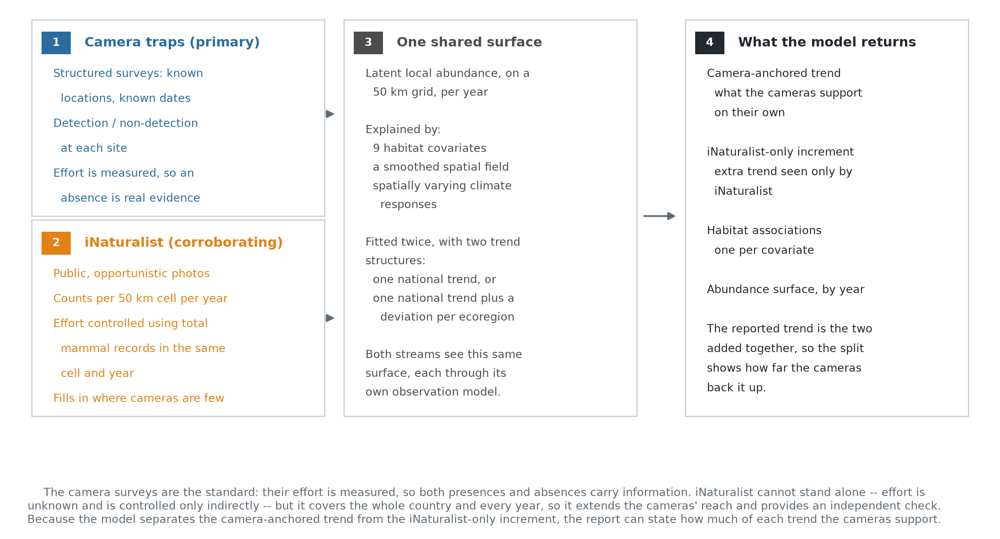

Camera-trap surveys are the primary stream: effort is measured, so both
detections and non-detections carry information. iNaturalist records cannot
stand alone — effort is unknown and is controlled only indirectly, using total
mammal records per 50 km grid cell per year as an effort offset — but they cover
the whole country and every year of the study period.

Both streams inform one latent relative-abundance surface on a 50 km grid, each
through its own observation model. The camera stream enters through an occupancy
submodel; the iNaturalist stream sees the same surface through a power-law link
whose exponent is estimated, which attenuates its influence when the two streams
disagree. That exponent is estimated between 0.41 and 0.61 across the six fits,
with every interval excluding 1.0, so the attenuation is active and substantial.

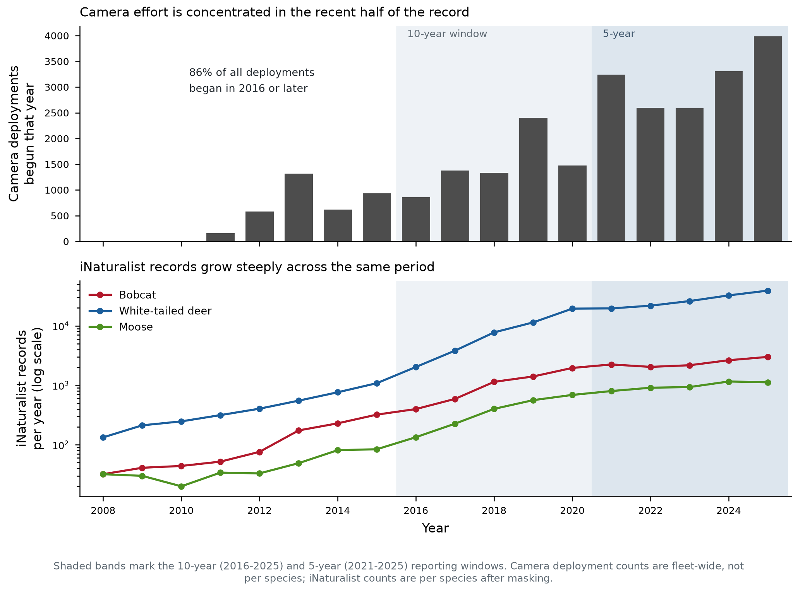

Camera deployments are concentrated in recent years. This is the reason trends
over the full 18-year window rest more heavily on the iNaturalist stream in the
early period, and it bears directly on how far each species' camera-anchored
trend extends: bobcat and deer have 16 distinct camera years, moose only 7
(cameras from 2019).

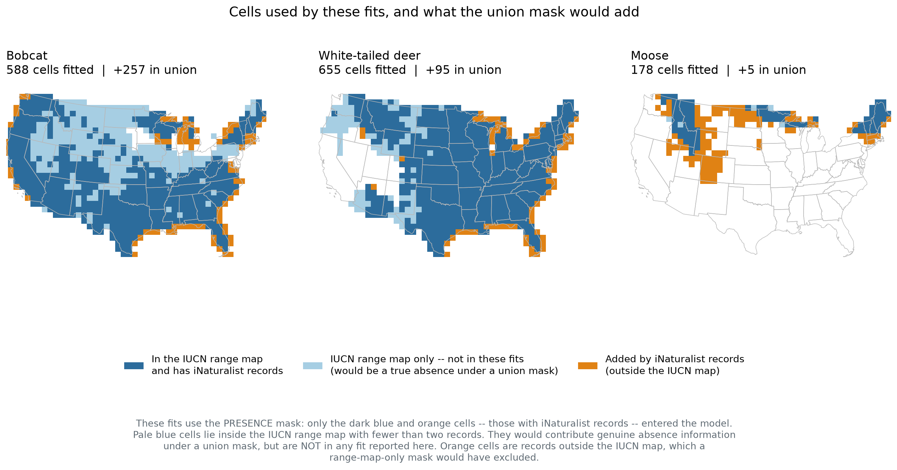

The modelled area for each species is defined by a presence mask: grid cells
are retained where the species has been recorded, rather than by a published
range polygon. This avoids excluding documented populations that fall outside a
static range map, at the cost of also excluding true-absence cells, where the
species genuinely does not occur but a camera or observer was present. A union
mask — the presence mask combined with the published range polygon, which would
retain those true-absence cells — has been constructed for these three species
but is not what the fits reported here use.

## 2. Why two parameterisations, and how each is set up

Each species is fitted twice, differing only in how the temporal trend is
allowed to vary in space.

**National-scalar.** One trend for the whole modelled area. The camera occupancy
submodel carries `year_beta * year_occ[i]`; the iNaturalist intensity carries
`total_var_beta * year_vals[t]`, where `total_var_beta = year_beta + year_var`
and `year_var` is a free parameter appearing in no camera likelihood term. This
maximises precision on the national trend and assumes the trend is spatially
constant.

**Ecoregion.** Adds a partially-pooled deviation per EPA Level I ecoregion,
`year_region[r] ~ dnorm(0, sd = sigma_region)`, inherited by each 100 km cell as
`year_effect[c] <- year_region[ecoregion_of_cell100[c]]` and added to the
iNaturalist-side trend. Partial pooling means each region's estimate borrows
strength from the shared national mean, so a data-poor region is shrunk toward
it rather than estimated independently. This relaxes the constant-trend
assumption at the cost of precision on the national mean.

Everything else is identical between the two: the same 50 km latent abundance
grid, the same nine occupancy covariates, the same spatially varying intercept
and climate-response fields on the 100 km grid, the same detection model, the
same iNaturalist negative-binomial count likelihood with its effort offset, and
the same presence mask. Both are run as single continuous MCMC chains with no
checkpoint-and-resume boundary.

**Why fit both rather than choose.** The pair is a sensitivity check on the
constant-trend assumption. If the national estimate is stable across the two,
that assumption is not doing load-bearing work and the simpler model can be
reported; if it moves, the regional structure matters and the national number
alone would be misleading. Fitting both is the right procedure even where only
one is ultimately reported.

One scope decision, documented in the model code, has consequences for what the
ecoregion fit can deliver and is stated where it bites, in Section 4: the
regional deviation was added to the iNaturalist pathway only, leaving the camera
submodel with the global trend.

## 3. National trends

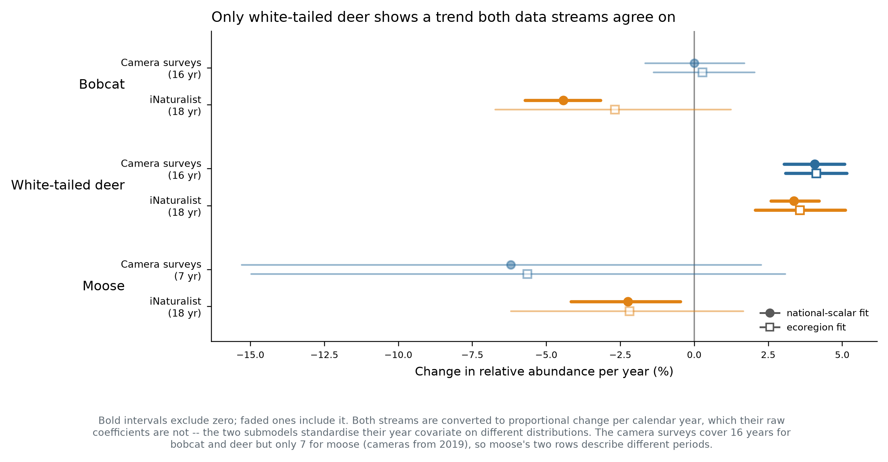

Both streams are shown as proportional change per calendar year. Their raw
coefficients are not comparable — the two submodels standardise their year
covariate on different distributions, so one coefficient unit is 5.34 years on
the iNaturalist side but 1.88 years for moose's cameras, 3.65 for bobcat's and
3.88 for deer's. Converting to per-year units first is required before the two
streams can be compared at all.

| Species | Camera surveys | iNaturalist | Agreement |
|---|---|---|---|
| Bobcat | **0.00%/yr** (−1.7, +1.7) | **−4.43%/yr** (−5.7, −3.2) | streams disagree |
| White-tailed deer | **+4.07%/yr** (+3.0, +5.1) | **+3.37%/yr** (+2.6, +4.2) | streams agree |
| Moose | **−6.20%/yr** (−15.3, +2.3) | **−2.24%/yr** (−4.2, −0.5) | same direction, cameras unresolved |

**White-tailed deer is increasing, and both streams agree.** The camera surveys
give +4.07% per year over 16 years and iNaturalist +3.37% over 18; both
intervals exclude zero and overlap each other. This is the only species in the
set whose trend is supported independently by each stream.

**Bobcat's streams disagree.** The camera surveys give a trend
indistinguishable from zero with a tight interval (−1.7% to +1.7% per year),
while iNaturalist gives a clear decline of 4.4% per year. Since the camera data
are the standard, the defensible statement is that **the camera surveys detect
no bobcat trend**, and that the iNaturalist decline is not corroborated. An
iNaturalist-specific change in observer behaviour or reporting that the effort
offset does not capture would produce exactly this pattern, and cannot be
distinguished from a real decline invisible to cameras.

**Moose is declining on the iNaturalist stream and unresolved on cameras.** The
camera-anchored estimate is steeper, at −6.2% per year, but its interval spans
zero, and it describes only 2019–2025 rather than the full period. The two rows
are not measuring the same interval for this species.

**Robustness to parameterisation.** The camera-anchored trend barely moves
between the two parameterisations — bobcat 0.00% versus +0.27%, deer +4.07%
versus +4.12%, moose −6.20% versus −5.64% — because the camera submodel is
identical in both. The iNaturalist-side estimate moves more, and loses
significance for bobcat and moose under the ecoregion parameterisation.

## 4. Regional trends

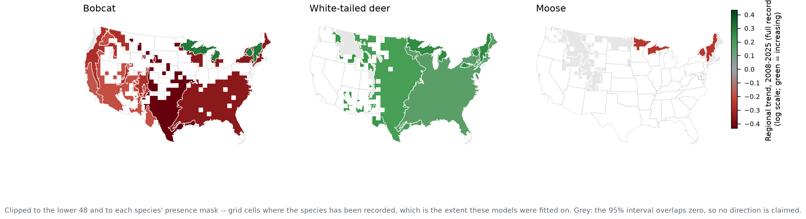

The camera data informs the ecoregion fit throughout: the spatially varying
intercept field, both climate-response surfaces, all nine occupancy covariates,
the detection model, and the global trend `year_beta` are all estimated with the
camera likelihood contributing. So regional differences in **abundance level**
are camera-informed, and are what the abundance surfaces in Section 5 display.

The constraint is narrower and applies to the regional **trend deviation**
specifically. `year_region` is added to the trend inside the iNaturalist
likelihood only, while the camera submodel carries the global `year_beta` with
no regional term — a deliberate prototype scope decision recorded in the model
code, not an oversight. So *how much a region's trend departs from the national
trend* is identified by iNaturalist alone, and these maps should be read
accordingly: regional variation in trend carries the same caveat as bobcat's
national iNaturalist estimate, while the regional pattern in abundance does not.
Regions shown in grey have intervals overlapping zero.

Two related questions are worth answering explicitly, because the obvious
alternatives do not supply a camera-anchored regional trend either.

**Regional prediction from covariates gives levels, not trends.** The occupancy
covariates enter as `occ_covars[i, 1:numOccCovars]` — indexed by site, with no
year dimension. They are static per location, so they cannot generate a temporal
trend of any kind, regional or national. Covariate-based regional prediction is
camera-informed and useful, but it predicts where a species is more or less
abundant, not where it is changing faster.

**A camera-anchored regional trend would require a model change**, adding a
regional deviation to the occupancy submodel. It cannot be extracted from the
present fits.

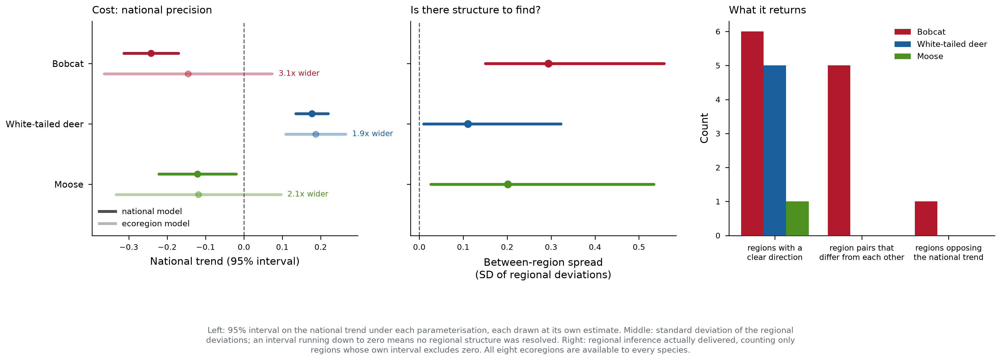

Whether the regional layer earns its cost is species-dependent: it resolves
genuine between-region structure for some species and only widens the interval
on the same national quantity for others, and regions with little data are
shrinkage toward the national mean rather than independent evidence.

## 5. Relative abundance surfaces

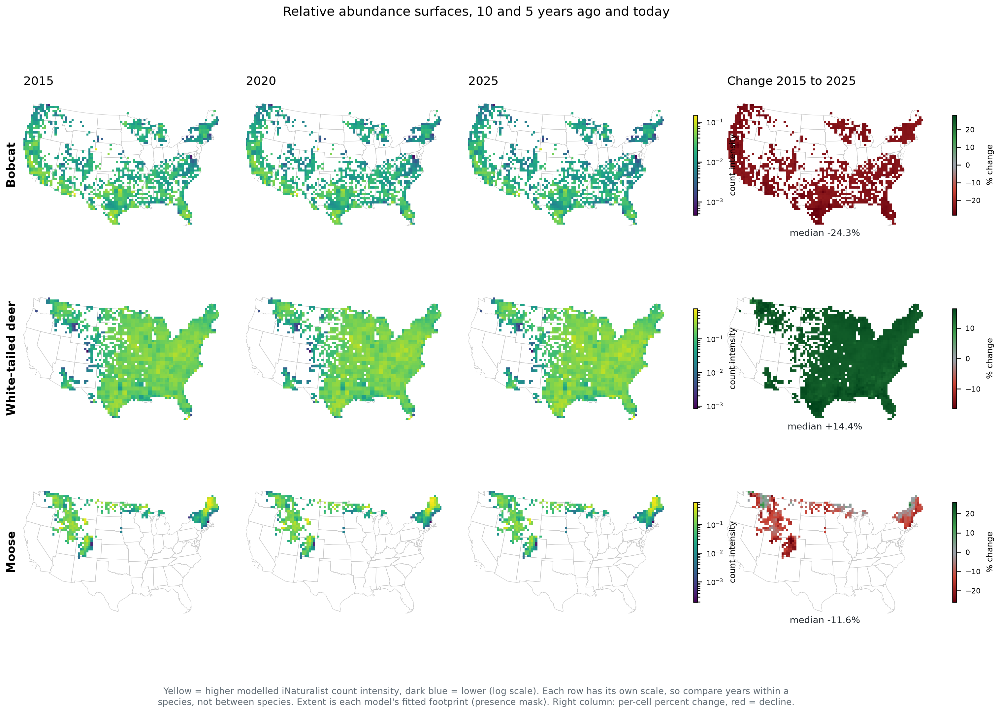

Per-year surfaces are informed by both streams: their spatial pattern comes
from the covariates, the spatially varying intercept and the climate fields, all
of which the camera data helps estimate. These maps are the camera-informed
regional picture of abundance.

**The change panel is not a regional trend, and should not be read as one.** In
the national-scalar parameterisation the trend is a single number applied to
every cell, so the proportional change is very nearly uniform in space: across
cells it has a standard deviation of 1.1% for bobcat around a median of −24.3%,
0.6% for deer around +14.4%, and 4.8% for moose around −28.2%. The map appears
spatially structured only because the *baseline* abundance surface is, not
because the rate of change varies. The small residual variation is a consequence
of summarising a nonlinear function by its posterior mean, not regional signal.

The change is also driven by the trend in the latent intensity field, which is
the iNaturalist-side quantity, so it carries the same caveat as the
corresponding national estimate — most consequentially for bobcat. A
camera-anchored change surface is constructible from the fitted occupancy
snapshots, which exist at 2015/2020/2025 for bobcat and deer and 2019/2025 for
moose, but at camera sites rather than on the full grid.

## 6. Comparison with state agency assessments

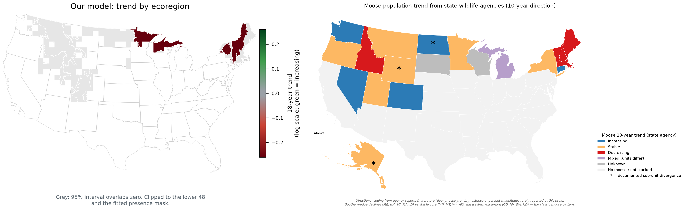

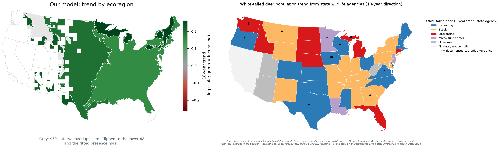

Modelled regional direction beside state agencies' own reported 10-year
directions, as compiled and without re-aggregation. No state-survey dataset
exists for bobcat, so no comparison is possible for that species.

## 7. Habitat and climate associations

These are estimated from the full record deliberately: unlike the trend, habitat
and climate associations improve with more years of data.

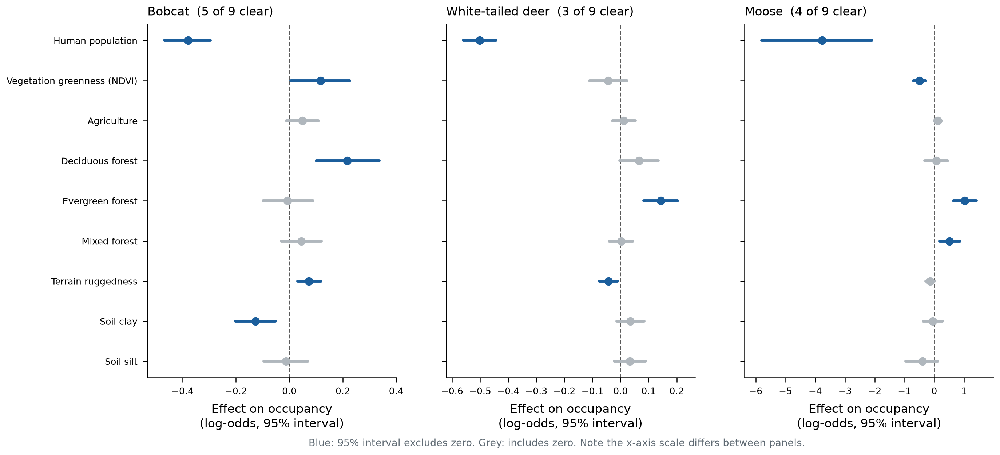

Nine occupancy covariates per fit. Sign agreement between the two
parameterisations is complete across all species and covariates.

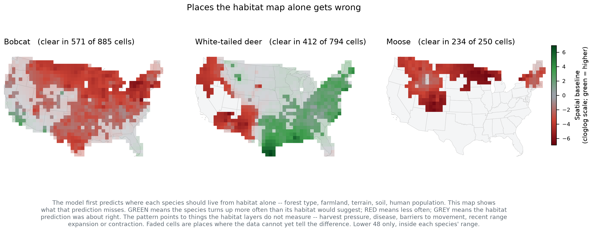

Where each species occurs more, or less, than the habitat covariates alone
predict — the smoothed spatial residual. Cells are at full opacity where the
95% interval excludes zero.

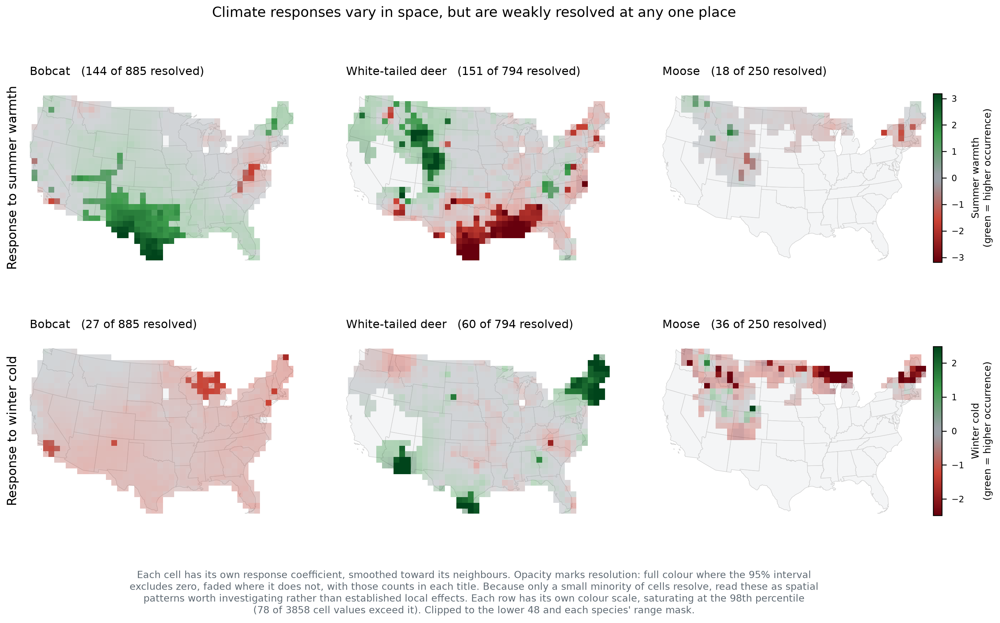

Spatially varying responses to summer warmth and winter cold. Only a small
minority of cells resolve individually, so these are spatial patterns worth
investigating rather than established local effects. Colour scales are per row,
since the two climate variables are not on a common scale.

## 8. Data-stream congruence and convergence

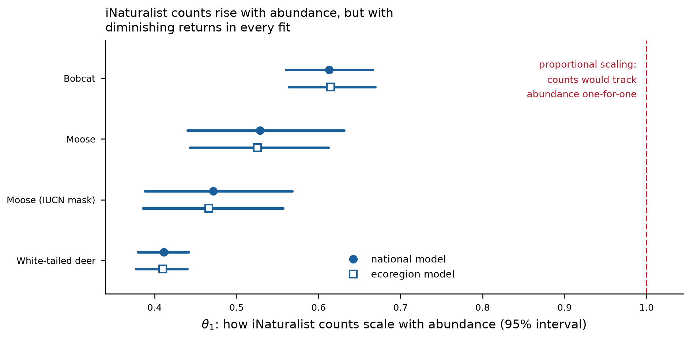

The power-law exponent linking the iNaturalist counts to the latent intensity is
sub-linear in every fit (0.41–0.61, all intervals excluding 1.0), meaning
iNaturalist counts rise less than proportionally with modelled abundance.

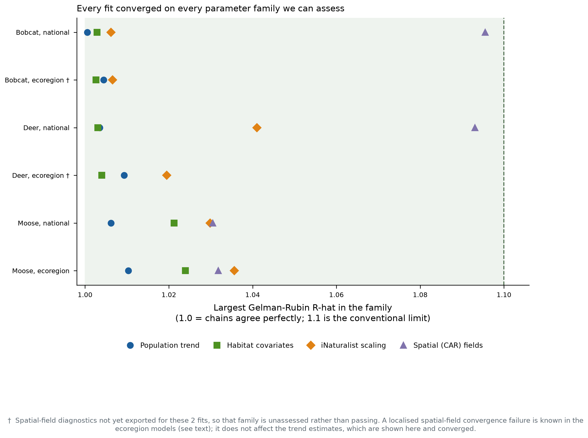

Trend and covariate parameters converged in all six fits. Both ecoregion fits
carry a localised convergence failure in one contiguous patch of the spatial
field, with substantial overlap between species, indicating a property of the
spatial adjacency graph rather than of either species' data. Trend estimates are
unaffected; the spatial intercept field and climate surfaces from the ecoregion
fits are excluded from the conclusions above.

## 9. Summary

1. **White-tailed deer is increasing at about 4% per year**, corroborated
   independently by camera surveys and iNaturalist.
2. **Camera surveys detect no bobcat trend.** The iNaturalist decline of 4.4%
   per year is not corroborated and should not be reported as a population
   trend on its own.
3. **Moose declines on the iNaturalist stream; the camera surveys cannot
   resolve it**, partly because moose camera data begin only in 2019.
4. **Regional differences in abundance are camera-informed; regional
   differences in *trend* are identified by iNaturalist alone**, because the
   regional deviation was scoped to the iNaturalist pathway. The three-period
   change maps are one national trend applied to a spatially varying baseline,
   not a regional trend.
5. Habitat and climate associations are consistent across parameterisations and
   are the most robust outputs of these models.

**Known limitations.** Camera effort is concentrated in recent years, so the
18-year iNaturalist window and the shorter camera window are not the same
period; 5- and 10-year windowed refits are pending. No agency comparison exists
for bobcat. The two streams' trend coefficients required unit conversion before
comparison, and their model-level sum mixes two scales, so it is not reported
here.
