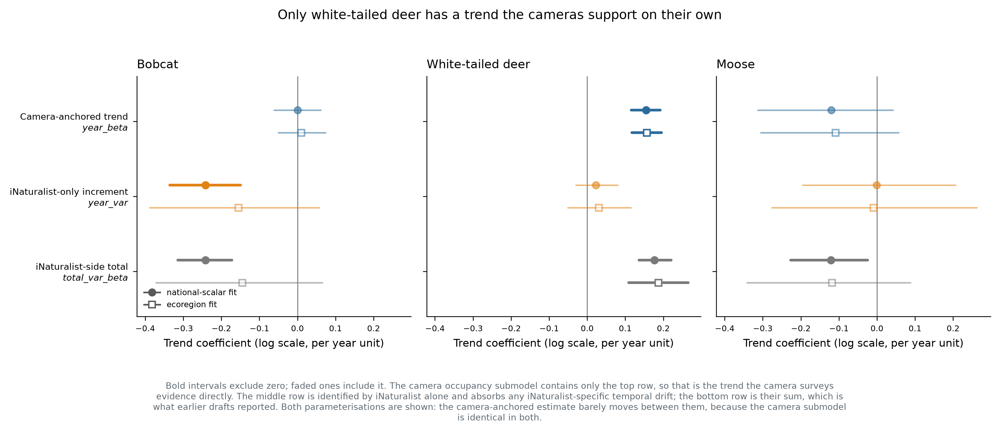
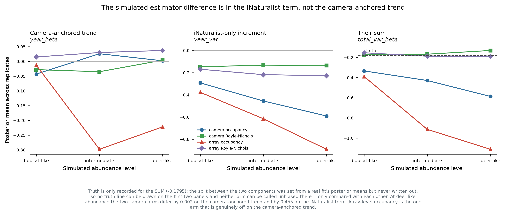
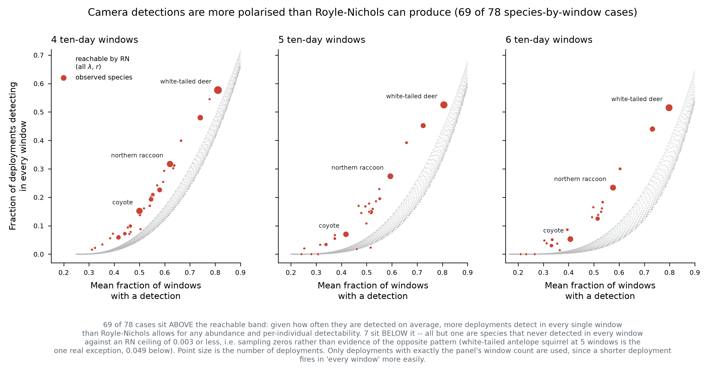

# Revised interpretation: camera-anchored trends

**Status:** revision of the trend sections of `MOOSE_v2b_RESULTS.md`,
`BOBCAT_WTD_v2b_RESULTS.md`, and the array-level simulation summary. Model code
and fits are unchanged; what changes is which parameter is reported as the
ecological result. No refit was required to produce anything in this document.

## 1. What changed

The model contains two trend parameters. The camera occupancy submodel carries
one of them:

```
cloglog(psi[i]) = link_occ_intercept[cell[i]] + ... + year_beta * year_occ[i]
```

The iNaturalist count submodel carries their sum:

```
log(lambda[s])  = ... + total_var_beta * year_vals[t]
total_var_beta  = year_beta + year_var
```

`year_var` therefore appears in no camera likelihood term. It is identified by
iNaturalist alone, and it is the mechanism by which the two streams' trends are
permitted to diverge — the temporal analogue of the divergence Goldstein et al.
build in spatially, where iNaturalist influences the latent intensity only
through `theta0`/`theta1` and the camera data is the gold standard. Our fits
estimate `theta1` between 0.41 and 0.61 with every interval excluding 1.0, so
that attenuation is active and substantial.

Earlier drafts reported `total_var_beta`. That is the iNaturalist-side quantity.
Following the same rule the ISDM paper applies to occupancy — report the camera
submodel's parameter — the ecological result is **`year_beta`**, and `year_var`
is context: a large `year_var` says the iNaturalist stream diverged, not that
the population changed.

This is a reporting correction on our side, not a defect in the model. The
divergence design worked exactly as intended, and bobcat demonstrates it: the
camera-anchored trend stayed pinned at zero while `year_var` absorbed the entire
iNaturalist decline, rather than the drift contaminating `year_beta`.

## 2. Revised species results



| Species | `year_beta` (camera-anchored) | `year_var` (iNat-only) | previously reported |
|---|---|---|---|
| Bobcat | **−0.0001** (−0.061, 0.061) | −0.242 (−0.336, −0.150) | −0.242, "clear decline" |
| White-tailed deer | **+0.155** (0.116, 0.192) | +0.022 (−0.030, 0.080) | +0.177, increase |
| Moose | **−0.121** (−0.313, 0.042) | −0.001 (−0.195, 0.206) | −0.121, "significant decline" |

**Bobcat: no camera-detected trend.** The camera-anchored estimate is
−0.0001 with a tight interval around zero, and the ecoregion fit agrees
(+0.0098, −0.051 to 0.074). The reported 24% decline is entirely the
iNaturalist-only term. Under the divergence rule this reads as *no trend*, with
iNaturalist indicating a decline that the cameras do not corroborate.

**White-tailed deer: an increase, camera-anchored.** +0.155 (0.116, 0.192) with
`year_var` indistinguishable from zero. This is the project's one trend that the
camera surveys evidence directly, and the revision strengthens rather than
weakens it — the result no longer depends on the iNaturalist term at all.

**Moose: declining but unresolved.** The camera-anchored interval spans zero in
both parameterisations. `total_var_beta` excluded zero in the national fit only
because the two components trade off in the posterior; note it does *not*
exclude zero in the ecoregion fit (−0.342, 0.088), so even the old headline was
parameterisation-dependent for moose.

**A robustness result worth keeping.** `year_beta` barely moves between
parameterisations — bobcat −0.0001 vs +0.0098, deer +0.155 vs +0.157, moose
−0.121 vs −0.109 — because the camera submodel is identical in both. The
camera-anchored trend is insensitive to a modelling choice that visibly moves
the iNaturalist-side total.

## 3. Regional trends have no camera-anchored version

This is a consequence of the same structure and it is more restrictive than the
national case. In `model_code_ecoregion_trend.R` the regional deviation enters
the iNaturalist likelihood only:

```
total_var_beta = total_var_beta + year_effect[inat_cell100[g]]    # iNat side
year_beta * year_occ[i]                                          # camera side
```

The camera submodel carries the global `year_beta` with **no regional term at
all**. `year_region` is therefore identified by iNaturalist alone, and
`abs_trend_mean` in the ecoregion outputs is `total_var_beta + year_region` —
wholly an iNaturalist-side quantity.

So there is no camera-anchored regional trend to report, and none can be
obtained from these fits. The regional trend maps carry exactly the caveat
bobcat's national trend carries, by construction rather than by accident. They
should be labelled as iNaturalist-side spatial variation in trend, not
presented as regional population trends. Producing a camera-corroborated
regional trend would require adding a regional deviation to the occupancy
submodel — a model change, not a re-extraction.

## 4. Abundance surfaces: the spatial pattern stands, the change does not

`mu` is built from `log(lambda)`, which contains `total_var_beta * year`. The
*temporal change* in the abundance surfaces is therefore driven by the
iNaturalist-side total, and bobcat's median −24.3% change panel is the same
uncorroborated signal in map form. The *spatial* pattern in any single year is
camera-informed through `lambda`'s spatial terms and is unaffected. Keep the
per-year surfaces; either drop the change column or label it explicitly as
iNaturalist-side.

## 5. Revised simulation interpretation



The sweep scored bias, interval width, coverage, power and false-positive rate
on `total_var_beta`. Decomposed, the four arms agree closely on `year_beta` and
diverge on `year_var`. At deer-like abundance the two camera-level arms differ
by **0.002** on the camera-anchored trend and by **0.455** on the iNaturalist
term.

**Retracted as stated:** "camera occupancy overstates declines 3–6× at deer
abundance." That is a statement about `year_var`, not about the trend we report.
On `year_beta` the two camera arms are indistinguishable at every abundance
level (gaps of 0.015, 0.061, 0.002).

**What survives, and is the sweep's real result:** the *aggregation* effect, not
the estimator effect. Array-level occupancy's `year_beta` reaches −0.222 at
deer-like and −0.298 at intermediate abundance, while both camera-level arms
stay within 0.06. Array-level aggregation genuinely damages the camera-anchored
trend; camera-level occupancy does not. This was previously confounded with the
occupancy-versus-Royle-Nichols comparison and now separates cleanly.

Also unaffected: the finding that detection rate is the wrong lens for judging
these estimators, since it conflates bias with precision.

**A limit on how far this can be taken.** Truth was recorded only for the sum
(`tvb_true` = −0.1795). The split was set from a real fit's posterior means
(`sim_helpers.R`: `year_beta = rp$year_beta, year_var = rp$year_var`) but never
written out, so no arm can be called unbiased on `year_beta` — only compared
with the others. Recovering that one number completes the re-scoring from rows
already on disk.

**And a scope limit on the whole sweep.** Replicates were generated from
`model_code_national_scalar` — the occupancy model — so the simulated data carry
Poisson-consistent heterogeneity. The sweep answers "if the occupancy model is
true, which estimator recovers the trend best." It does not answer "which
estimator works on our data," and in particular it never exposed Royle-Nichols
to the overdispersion measured in Section 6. Worth noting that Royle-Nichols was
the *misspecified* model there and still matched the correctly-specified one,
which is evidence for its robustness on trends.

## 6. Royle-Nichols is not a drop-in alternative



Occupancy saturates: `psi = 1 − exp(−lambda)`, so its information about
`log(lambda)` collapses once most sites are near-certain detections. That is a
real limitation, and it is species-specific. From the fitted per-site `psi`,
white-tailed deer sits at a median of 0.952 with 68.2% of sites above 0.9 and
half above `lambda` = 3; bobcat (0.156) and moose (0.033) are far from
saturation and are in occupancy's *better* operating range. Range-restricted
naive occupancy across all 34 fleet species puts deer at 0.794 and the next
species — eastern gray squirrel — at 0.478, so deer is an outlier rather than
the top of a gradient. Commonly-detected species such as gray squirrel and
raccoon are near occupancy's most informative point, not past it.

Royle-Nichols avoids saturation by reading detection frequency, but its
observation model does not fit our camera data. Comparing two statistics among
detecting deployments — mean fraction of 10-day windows with a detection, and
fraction of deployments detecting in every window — against the region
reachable by RN over all `(lambda, r)`: **69 of 78 species-by-window-count cases
fall above the reachable band**, 2 inside, and 7 below of which 6 are sampling
zeros against an RN ceiling of 0.003 or less. Real detections are more polarised
than Poisson abundance with constant per-individual detectability can generate.

Two further limits worth stating. `lambda` and `r` are not separately identified
from these data at our window counts — at J=4, (25, 0.03) and (0.11, 0.52)
reproduce the same two moments to machine precision — so no per-species
abundance cutoff can be derived this way. And the band is built from two summary
statistics rather than the full detection-history likelihood; a proper
goodness-of-fit test would probably reject harder, but not in the other
direction.

Candidate alternatives, in the order we would try them: a detection-rate count
model (negative binomial on events per camera-night, which gives both streams
the same form and no saturation, at the cost of conflating abundance with
activity); Royle-Nichols with negative-binomial abundance; or Royle-Nichols with
a site-level random effect on `r`, which is testable rather than assumed since
`feature_type` records on-trail versus random placement.

## 7. Unaffected by this revision

- Covariate effects (`occ_beta`, 9 covariates × 8 fits) — occupancy submodel
  parameters, unchanged, with perfect sign agreement across parameterisations.
- Convergence diagnostics, including the shared CAR-field convergence failure in
  the ecoregion fits.
- The `theta0`/`theta1` congruence results, and the spatial baseline and climate
  response fields — all estimated from the full record and independent of the
  trend parameters.
- Habitat and climate associations generally: these improve with more years of
  data, whereas the trend is compromised by the sparse early camera years. The
  report draws them from the full-record fits deliberately.

One correction to the congruence section: `trend_robust_indicator` is
reportable, contrary to an earlier note here. It has real posterior means
(bobcat 0.0005, moose 0.2599, deer 0.7836); it is `snr_derived`, the raw
`year_beta/year_var` ratio, whose mean is undefined. The indicator's weakness is
narrower than "cannot be computed": it thresholds a ratio whose denominator sits
near zero, so where `year_var` spans zero the resulting probability is unstable
rather than undefined. Moose is the example — `year_var` = −0.0006 (−0.195,
0.206) with an indicator of 0.26. Testing `year_var` against zero directly is
the better-behaved replacement, and it is exactly the question the indicator was
built to answer.

## 8. Outstanding

1. `truth$year_beta` from `inputs$real_post_means` — one value, completes the
   sweep's bias re-scoring from existing rows with no new compute.
2. Per-replicate `year_beta` quantiles for coverage, power and false-positive
   rate on the camera-anchored trend. Only means were recorded
   (`sim_helpers_estimator_metrics.R:84`), so this needs a re-collect if the
   sample files persist on Hazel, and a re-run only if they do not.
3. Deer restricted-site refit — drop camera sites above `psi` ≈ 0.95 and check
   whether `year_beta` moves. Deer's posterior SD of 0.019 against a prior scale
   of order 1 says the data dominate the prior, so we expect stability; this
   would confirm it. One species, one fit.
4. A regional deviation in the occupancy submodel, if camera-corroborated
   regional trends are wanted. Model change, needs team agreement.
5. The 5- and 10-year windowed refits remain blocked on the base-bundle
   reconstruction, unchanged by this revision.
